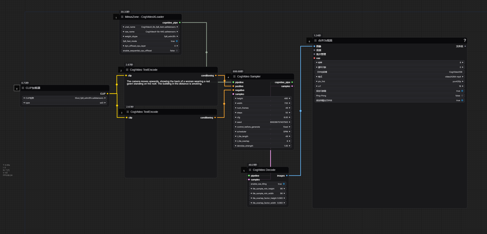

# ComfyUI-CogVideoX-MZ

CogVideoX-5B的模型加载器

依赖 https://github.com/kijai/ComfyUI-CogVideoXWrapper

模型下载地址
https://modelscope.cn/models/wailovet/CogVideoX-5b/resolve/master/CogVideoX_5b_fp8_4em.safetensors 下载到unet文件夹

https://modelscope.cn/models/zhipuai/cogvideox-5b/resolve/master/vae/diffusion_pytorch_model.safetensors  下载到vae文件夹(记得重命名文件名方便辨认)

https://modelscope.cn/models/ai-modelscope/flux_text_encoders/resolve/master/t5xxl_fp8_e4m3fn.safetensors  下载到clip文件夹(和sd3/flux通用,不需要重复下载)

