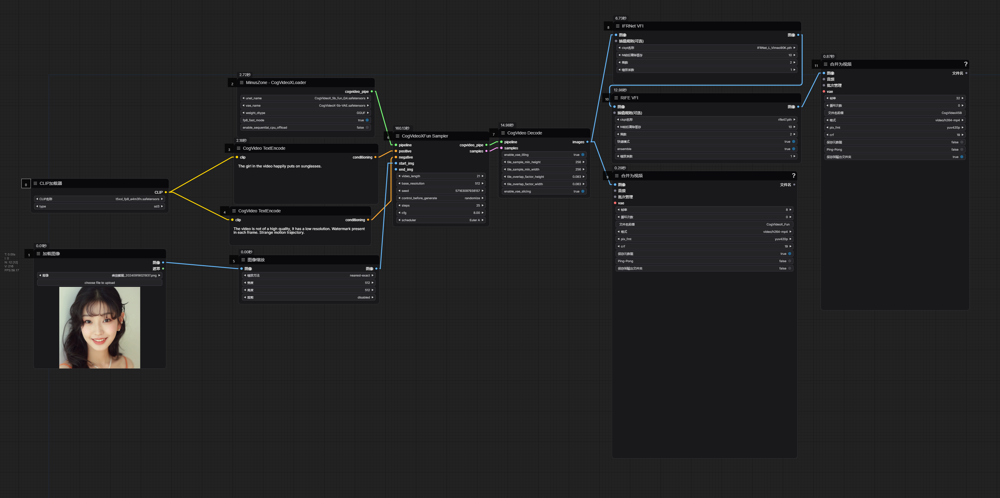

# ComfyUI-CogVideoX-MZ
## Update - 2024-09-19
支持CogVideoX-Fun图生视频, 提供Q4量化模型

(support CogVideoX-Fun image to video, provide Q4 quantization model)

[CogVideoX_Fun_GGUF_Q4_0.safetensors](https://modelscope.cn/models/wailovet/CogVideoX-5b/resolve/master/CogVideoX_5b_fun_GGUF_Q4_0.safetensors) 下载到unet文件夹

工作流在examples\workflow_I2V_GGUF_Q4_0.png (Workflow in examples\workflow_I2V_GGUF_Q4_0.png)

## Update - 2024-09-05
部分层4位量化模型, 采样方式选择DPM, weight_dtype选择GGUF, cpu_offload不启用分辨率480x720在32帧下占用显存小于8G

(CogVideoX-5B 4-bit quantization model, when using it, the sampling method needs to select DPM, weight_dtype selects GGUF, and cpu_offload is not enabled)

[CogVideoX_5b_GGUF_Q4_0.safetensors](https://modelscope.cn/models/wailovet/CogVideoX-5b/resolve/master/CogVideoX_5b_GGUF_Q4_0.safetensors) 下载到unet文件夹

4位量化工作流在examples\workflow_GGUF_Q4_0.png

## 使用
CogVideoX-5B的模型加载器

依赖 https://github.com/kijai/ComfyUI-CogVideoXWrapper

模型下载地址

[CogVideoX_5b_fp8_4em.safetensors](https://modelscope.cn/models/wailovet/CogVideoX-5b/resolve/master/CogVideoX_5b_fp8_4em.safetensors) 下载到unet文件夹 

[diffusion_pytorch_model.safetensors](https://modelscope.cn/models/zhipuai/cogvideox-5b/resolve/master/vae/diffusion_pytorch_model.safetensors) 下载到vae文件夹(记得重命名文件名方便辨认)

[t5xxl_fp8_e4m3fn.safetensors](https://modelscope.cn/models/ai-modelscope/flux_text_encoders/resolve/master/t5xxl_fp8_e4m3fn.safetensors) 下载到clip文件夹(和sd3/flux通用,不需要重复下载)

工作流在examples\workflow.png

