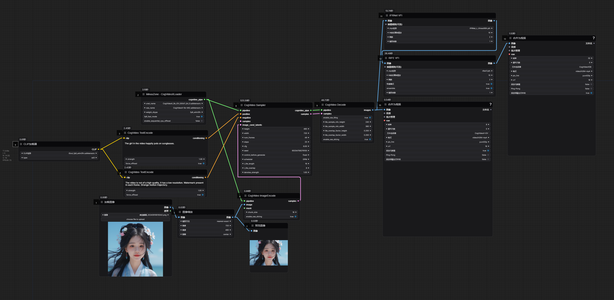

# ComfyUI-CogVideoX-MZ 

在 https://github.com/kijai/ComfyUI-CogVideoXWrapper 的基础上增加一个独立的模型加载器和一些其他的功能, 使用前需要先安装ComfyUI-CogVideoXWrapper
 
Based on https://github.com/kijai/ComfyUI-CogVideoXWrapper add model loader and some other features, you need to install ComfyUI-CogVideoXWrapper before using

## Update - 2024-09-24
添加vae encode tiling开关, 在16G显存下可以生成1024分辨率的视频不会OOM

(add vae encode tiling switch, can generate 1024 resolution video without OOM on 16G vram)

## Update - 2024-09-22
支持CogVideoX-I2V图生视频, 提供Q4量化模型

(support CogVideoX-I2V image to video, provide Q4 quantization model)

[CogVideoX_5b_I2V_GGUF_Q4_0.safetensors](https://huggingface.co/Kijai/CogVideoX_GGUF/resolve/main/CogVideoX_5b_I2V_GGUF_Q4_0.safetensors) 下载到unet文件夹 (Donwload to unet folder)

工作流在examples\workflow_I2V_GGUF_Q4_0.png (Workflow in examples\workflow_I2V_GGUF_Q4_0.png)

Prompt :The girl in the video happily puts on sunglasses.

https://github.com/user-attachments/assets/3eae12b7-1a2d-40c5-b6fb-10afb1349f4e

## Update - 2024-09-19
支持CogVideoX-Fun图生视频, 提供Q4量化模型

(support CogVideoX-Fun image to video, provide Q4 quantization model)

[CogVideoX_Fun_GGUF_Q4_0.safetensors](https://modelscope.cn/models/wailovet/CogVideoX-5b/resolve/master/CogVideoX_5b_fun_GGUF_Q4_0.safetensors) 下载到unet文件夹 (Donwload to unet folder)

工作流在examples\workflow_FUN_I2V_GGUF_Q4_0.png (Workflow in examples\workflow_FUN_I2V_GGUF_Q4_0.png)

Prompt :The girl in the video happily puts on sunglasses.

https://github.com/user-attachments/assets/32101df0-d50c-404a-a2ea-3ddff0dcc59b

## Update - 2024-09-05
部分层4位量化模型, 采样方式选择DPM, weight_dtype选择GGUF, cpu_offload不启用分辨率480x720在32帧下占用显存小于8G

(CogVideoX-5B 4-bit quantization model, when using it, the sampling method needs to select DPM, weight_dtype selects GGUF, and cpu_offload is not enabled)

[CogVideoX_5b_GGUF_Q4_0.safetensors](https://modelscope.cn/models/wailovet/CogVideoX-5b/resolve/master/CogVideoX_5b_GGUF_Q4_0.safetensors) 下载到unet文件夹

4位量化工作流在examples\workflow_GGUF_Q4_0.png

## 使用
CogVideoX-5B的模型加载器

依赖 https://github.com/kijai/ComfyUI-CogVideoXWrapper

模型下载地址

[CogVideoX_5b_fp8_4em.safetensors](https://modelscope.cn/models/wailovet/CogVideoX-5b/resolve/master/CogVideoX_5b_fp8_4em.safetensors) 下载到unet文件夹 

[diffusion_pytorch_model.safetensors](https://modelscope.cn/models/zhipuai/cogvideox-5b/resolve/master/vae/diffusion_pytorch_model.safetensors) 下载到vae文件夹(记得重命名文件名方便辨认)

[t5xxl_fp8_e4m3fn.safetensors](https://modelscope.cn/models/ai-modelscope/flux_text_encoders/resolve/master/t5xxl_fp8_e4m3fn.safetensors) 下载到clip文件夹(和sd3/flux通用,不需要重复下载)

工作流在examples/*.png

## Usage

CogVideoX-5B model loader

Depends on https://github.com/kijai/ComfyUI-CogVideoXWrapper

Model download address

[CogVideoX_5b_fp8_4em.safetensors](https://modelscope.cn/models/wailovet/CogVideoX-5b/resolve/master/CogVideoX_5b_fp8_4em.safetensors) Download to unet folder

[diffusion_pytorch_model.safetensors](https://modelscope.cn/models/zhipuai/cogvideox-5b/resolve/master/vae/diffusion_pytorch_model.safetensors) Download to vae folder (remember to rename the file name for easy identification)

[t5xxl_fp8_e4m3fn.safetensors](https://modelscope.cn/models/ai-modelscope/flux_text_encoders/resolve/master/t5xxl_fp8_e4m3fn.safetensors) Download to clip folder (universal with sd3/flux, no need to download repeatedly)

Workflow in examples/*.png

## Credits

- [CogVideo](https://github.com/THUDM/CogVideo)
- [CogVideoX-Fun](https://github.com/aigc-apps/CogVideoX-Fun)
- [ComfyUI-CogVideoXWrapper](https://github.com/kijai/ComfyUI-CogVideoXWrapper)
